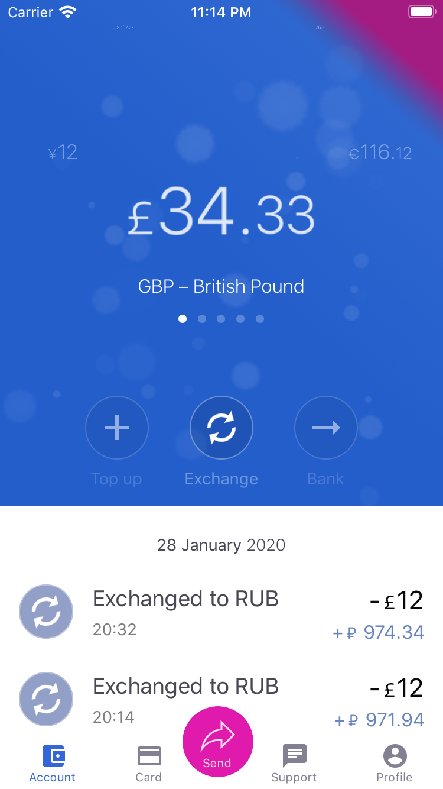

# Revolut Task

Currency exchange application.

## Screenshots

### iOS

<div class="center">
  
  
  
</div>

### Android

<div class="center">
  
  
  
</div>

### Installation

```shell
yarn install
```

### Commands

- `yarn start:web` - runs the Web version of the app in the development mode
- `yarn build:web` - builds the Web version of the app for production to the **dist-web** folder
- `yarn start:ios` - runs the iOS version of the app and attempts to open in the iOS Simulator if you're on a Mac and have it installed
- `yarn start:android` - runs the Android version of the app and attempts to open your app on a connected Android device or emulator
- `yarn start:windows` - runs the Windows version of the app
- `yarn start:rn-dev-server` - runs react native (RN) development server
- `yarn start:next` - runs Next.js server

- `yarn test` – runs the tests using Jest and Enzyme

---

Created by **create-rx-app@0.6.4**

## Making use of

- [Typescript](https://www.typescriptlang.org/)
- [Babel](https://babeljs.io/)
- [Webpack](https://webpack.js.org/)
- [React](https://reactjs.org/)
- [ReactXP](https://microsoft.github.io/reactxp/)
- [Redux](https://redux.js.org/)
- [Redux Saga](https://redux-saga.js.org/)
- [Redux Persist](https://github.com/rt2zz/redux-persist)
- [DayJS](https://day.js.org/)
- [React Native](https://reactnative.dev/)
- [Jest](https://jestjs.io/)
- [Enzyme](https://enzymejs.github.io/enzyme/)
- [Next.js](https://nextjs.org/) (API proxy and simple SSR)
- [Material Icons](https://material.io/resources/icons/) (by SVG)

### Plus

- CSS in JS
- Debounce